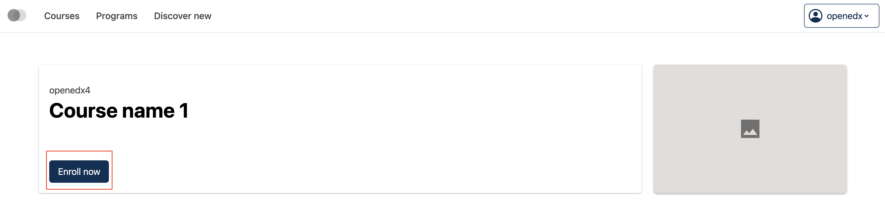
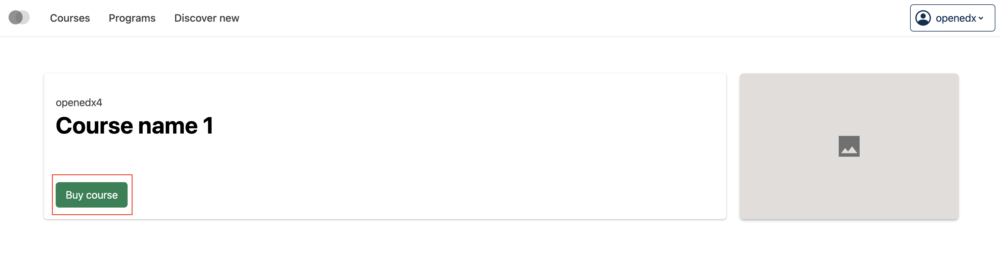

# Course enrollment button slot

### Slot ID: `org.openedx.frontend.catalog.course_about_page.enrollment_button`

## Description

This slot is used to replace/modify/hide the entire course enrollment button on the Course about page.

## Examples

### Default content



### Replaced with custom component



The following `env.config.tsx` will replace the course enrollment button entirely (in this case with custom button component)

```tsx
import { DIRECT_PLUGIN, PLUGIN_OPERATIONS } from '@openedx/frontend-plugin-framework';
import { Button } from '@openedx/paragon';

const config = {
  pluginSlots: {
    'org.openedx.frontend.catalog.course_about_page.enrollment_button': {
      keepDefault: false,
      plugins: [
        {
          op: PLUGIN_OPERATIONS.Insert,
          widget: {
            id: 'custom_course_about_page_enrollment_button_component',
            type: DIRECT_PLUGIN,
            RenderWidget: ({
              singlePaidMode,
              ecommerceCheckout,
              isEnrollmentPending,
              onEnroll,
              onEcommerceCheckout,
            }) => {
              const handleClick = () => {
                if (singlePaidMode && ecommerceCheckout) {
                  onEcommerceCheckout();
                } else {
                  onEnroll();
                }
              };

              return (
                <Button onClick={handleClick} disabled={isEnrollmentPending} variant="success">
                  {isEnrollmentPending
                    ? 'Loading...'
                    : singlePaidMode
                      ? 'Buy course'
                      : 'Enroll in course'
                  }
                </Button>
              );
            },
          },
        },
      ]
    }
  },
}

export default config;
```
