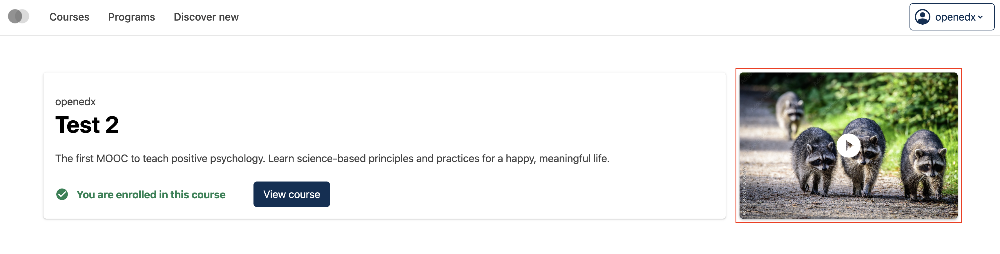
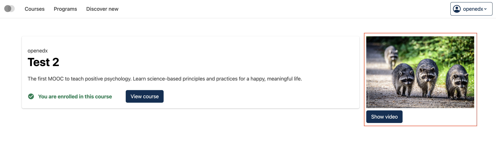

# Course about page video button slot

### Slot ID: `org.openedx.frontend.catalog.home_page.promo_video_button`

## Description

This slot is used to replace/modify/hide the entire Course about page video button.

## Examples

### Default content



### Replaced with custom component



The following `env.config.tsx` will replace the Course about page video button entirely (in this case with a centered `h1` tag)

```tsx
import { DIRECT_PLUGIN, PLUGIN_OPERATIONS } from '@openedx/frontend-plugin-framework';
import { Button, Image } from '@openedx/paragon';

const config = {
  pluginSlots: {
    'org.openedx.frontend.catalog.course_about_page.intro_video_button': {
      keepDefault: false,
      plugins: [
        {
          op: PLUGIN_OPERATIONS.Insert,
          widget: {
            id: 'custom_course_about_page_intro_video_button_component',
            type: DIRECT_PLUGIN,
            RenderWidget: ({ courseImageSrc, courseImageAltText, openVideoModal }) => (
              <>
                <Image
                  className="mb-2"
                  width="100%"
                  src={courseImageSrc}
                  alt={courseImageAltText}
                />
                <Button onClick={openVideoModal}>
                  Show video
                </Button>
              </>
            ),
          },
        },
      ]
    }
  },
}

export default config;
```
