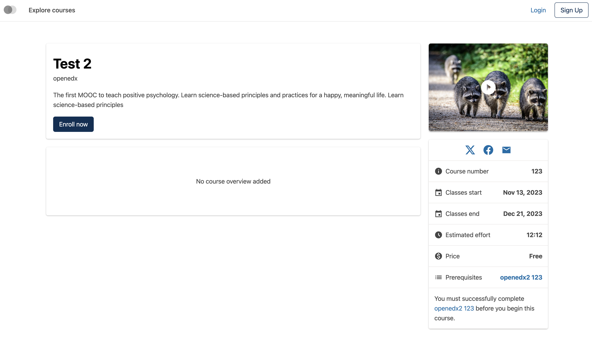
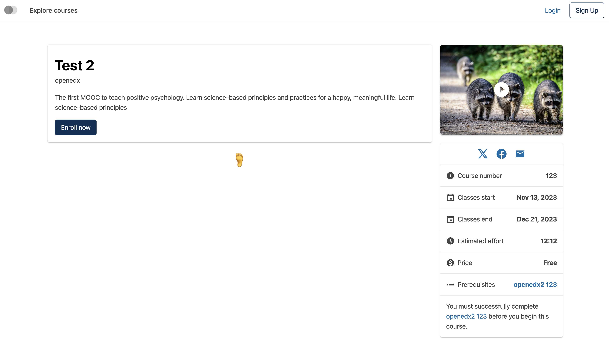
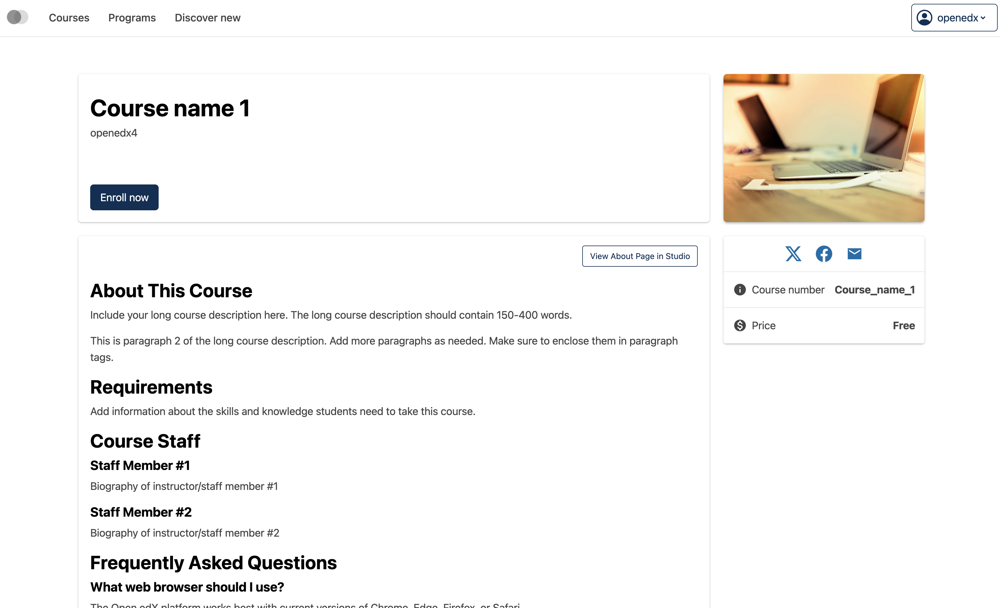
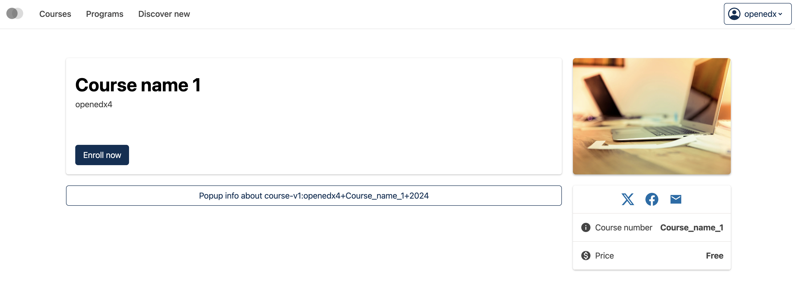
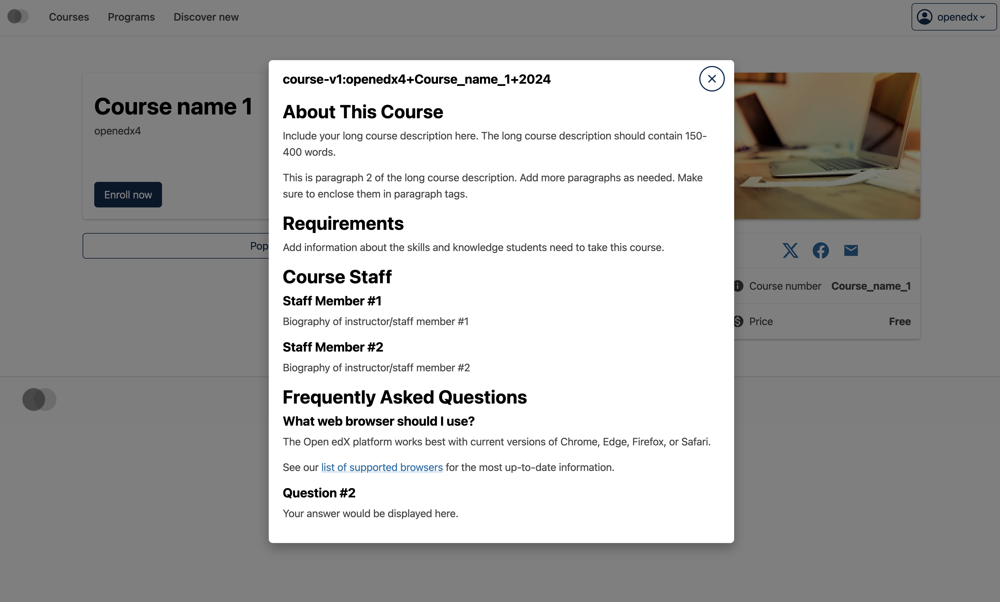

# Course about overview slot

### Slot ID: `org.openedx.frontend.catalog.course_about_page.overview`

## Description

This slot is used to replace/modify/hide the entire course about overview section on the Course about page.

### Plugin Props:

* `overviewData` - Object. HTML content of the course overview section.
* `courseId` - String. The unique identifier of the course.

## Examples

### Default content



### Replaced with custom component



The following `env.config.tsx` will replace the Course About page overview slot entirely (in this case with a centered `h1` tag)

```tsx
import { DIRECT_PLUGIN, PLUGIN_OPERATIONS } from '@openedx/frontend-plugin-framework';

const config = {
  pluginSlots: {
    'org.openedx.frontend.catalog.course_about_page.overview': {
      keepDefault: false,
      plugins: [
        {
          op: PLUGIN_OPERATIONS.Insert,
          widget: {
            id: 'custom_about_page_overview_component',
            type: DIRECT_PLUGIN,
            RenderWidget: () => (
              <h1 style={{textAlign: 'center'}}>🦶</h1>
            ),
          },
        },
      ]
    }
  },
}

export default config;
```

### Custom component with plugin props

**Default overview section:**


**Custom button component:**


**Modal dialog with course overview content:**


The following `env.config.tsx` example demonstrates how to replace the Course About page overview slot with a custom component that uses the plugin props (`overviewData` and `courseId`). In this case, it creates a modal dialog that displays the course overview content when a button is clicked.

```tsx
import { DIRECT_PLUGIN, PLUGIN_OPERATIONS } from '@openedx/frontend-plugin-framework';
import { useToggle, Button, ModalDialog } from '@openedx/paragon';

const CourseOverviewModal = ({ overviewData, courseId }) => {
  const [isOpen, open, close] = useToggle(false);

  return (
    <>
      <Button variant="outline-primary" onClick={open}>
        Popup info about {courseId}
      </Button>
      <ModalDialog
          size="lg"
          isOpen={isOpen}
          onClose={close}
          hasCloseButton
          isFullscreenOnMobile
          isOverflowVisible={false}
      >
        <ModalDialog.Header>
          <ModalDialog.Title>
            {courseId}
          </ModalDialog.Title>
        </ModalDialog.Header>
        <ModalDialog.Body>
          <div dangerouslySetInnerHTML={{ __html: overviewData }} />
        </ModalDialog.Body>
      </ModalDialog>
    </>
  )
}

const config = {
  pluginSlots: {
    'org.openedx.frontend.catalog.course_about_page.overview': {
      keepDefault: false,
      plugins: [
        {
          op: PLUGIN_OPERATIONS.Insert,
          widget: {
            id: 'custom_about_page_overview_component',
            type: DIRECT_PLUGIN,
            RenderWidget: ({ overviewData, courseId }) => (
              <CourseOverviewModal overviewData={overviewData} courseId={courseId} />
            ),
          },
        },
      ]
    }
  },
}

export default config;
```
