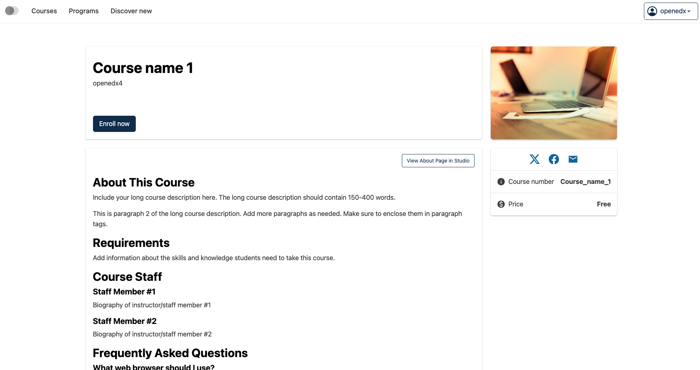
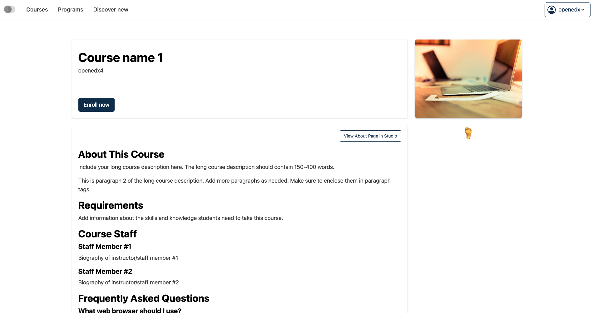
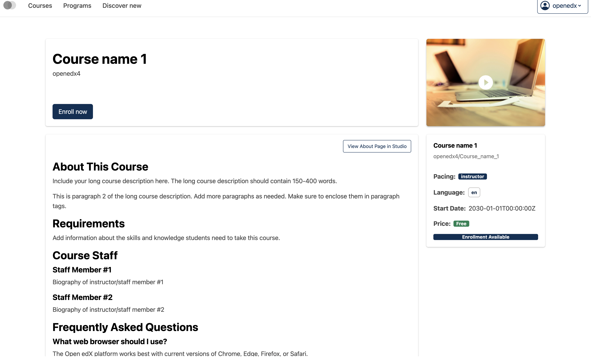

# Course about page sidebar slot

### Slot ID: `org.openedx.frontend.catalog.course_about_page.sidebar`

## Description

This slot is used to replace/modify/hide the entire Course about page sidebar.

### Plugin Props:

* `courseAboutData` - Object. The course about page data object containing course information such as id, name, start/end dates, enrollment details, media, pricing, prerequisites, and other course metadata.

## Examples

### Default content



### Replaced with custom component



The following `env.config.tsx` will replace the Course about page sidebar entirely (in this case with a centered `h1` tag)

```tsx
import { DIRECT_PLUGIN, PLUGIN_OPERATIONS } from '@openedx/frontend-plugin-framework';

const config = {
  pluginSlots: {
    'org.openedx.frontend.catalog.course_about_page.sidebar': {
      keepDefault: false,
      plugins: [
        {
          op: PLUGIN_OPERATIONS.Insert,
          widget: {
            id: 'custom_course_about_page_sidebar_component',
            type: DIRECT_PLUGIN,
            RenderWidget: () => (
              <h1 style={{textAlign: 'center'}}>🦶</h1>
            ),
          },
        },
      ]
    }
  },
}

export default config;
```

### Custom component with plugin props



The following `env.config.tsx` example demonstrates how to replace the Course about page sidebar slot with a custom component that uses the plugin props (`courseAboutData`). In this case, it creates a custom sidebar component that displays key course information in a simplified format with badges and highlights.

```tsx
import { DIRECT_PLUGIN, PLUGIN_OPERATIONS } from '@openedx/frontend-plugin-framework';
import { Card, Badge, Stack, Chip } from '@openedx/paragon';

const config = {
  pluginSlots: {
    'org.openedx.frontend.catalog.course_about_page.sidebar': {
      keepDefault: false,
      plugins: [
        {
          op: PLUGIN_OPERATIONS.Insert,
          widget: {
            id: 'custom_course_about_page_sidebar_component',
            type: DIRECT_PLUGIN,
            RenderWidget: ({ courseAboutData }) => {
              if (!courseAboutData) {
                return null;
              }

              return (
                <Card>
                  <Card.Section>
                    <Stack gap={3}>
                      <div>
                        <h4>{courseAboutData.name}</h4>
                        <p className="text-muted small">
                          {courseAboutData.displayOrgWithDefault}/{courseAboutData.displayNumberWithDefault}
                        </p>
                      </div>

                      {courseAboutData.effort && (
                        <Stack direction="horizontal" gap={2}>
                          <strong>Effort:</strong> {courseAboutData.effort}
                        </Stack>
                      )}

                      {courseAboutData.pacing && (
                        <Stack direction="horizontal" gap={2}>
                          <strong>Pacing:</strong> <Badge>{courseAboutData.pacing}</Badge>
                        </Stack>
                      )}

                      {courseAboutData.language && (
                        <Stack direction="horizontal" gap={2}>
                          <strong>Language:</strong> <Chip>{courseAboutData.language}</Chip>
                        </Stack>
                      )}

                      {courseAboutData.start && (
                        <Stack direction="horizontal" gap={2}>
                          <strong>Start Date:</strong> {courseAboutData.startDisplay || courseAboutData.start}
                        </Stack>
                      )}

                      {courseAboutData.coursePrice && (
                        <Stack direction="horizontal" gap={2}>
                          <strong>Price:</strong> <Badge variant="success">{courseAboutData.coursePrice}</Badge>
                        </Stack>
                      )}

                      {courseAboutData.canEnroll && (
                        <Badge>Enrollment Available</Badge>
                      )}
                    </Stack>
                  </Card.Section>
                </Card>
              );
            },
          },
        },
      ]
    }
  },
}

export default config;
```
