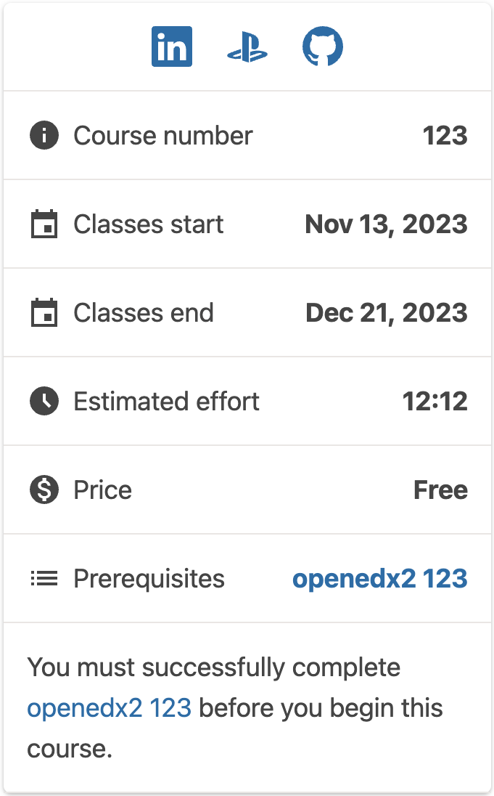
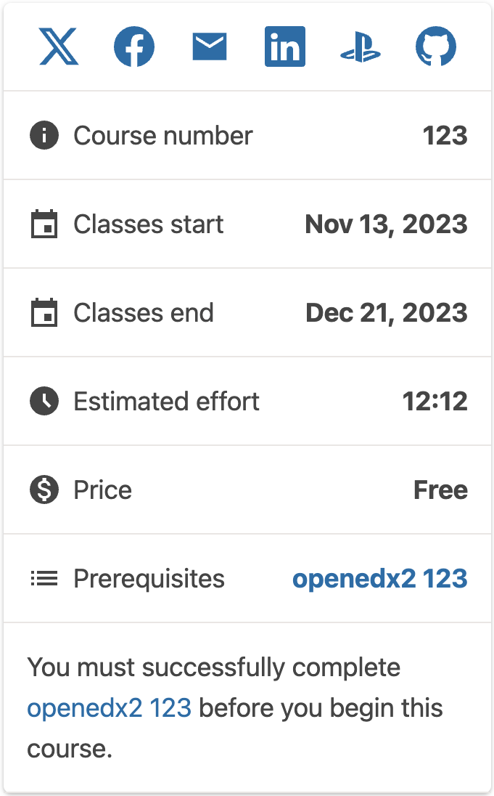
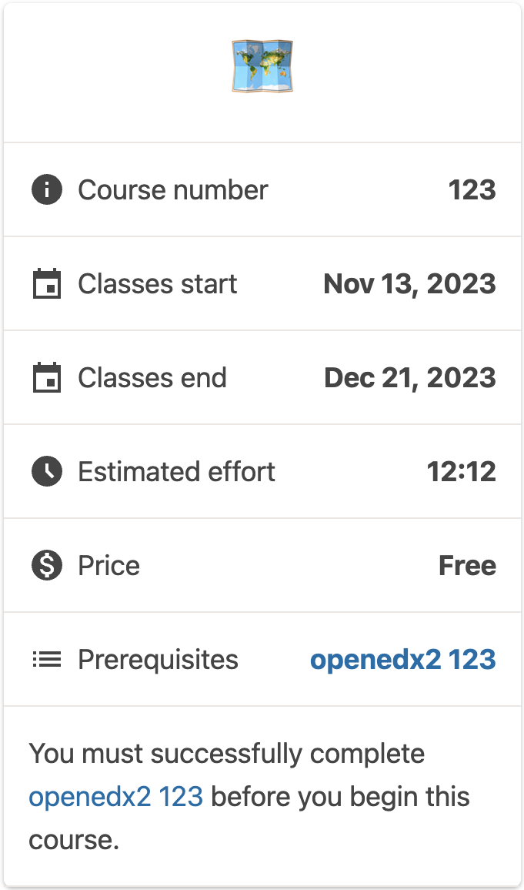
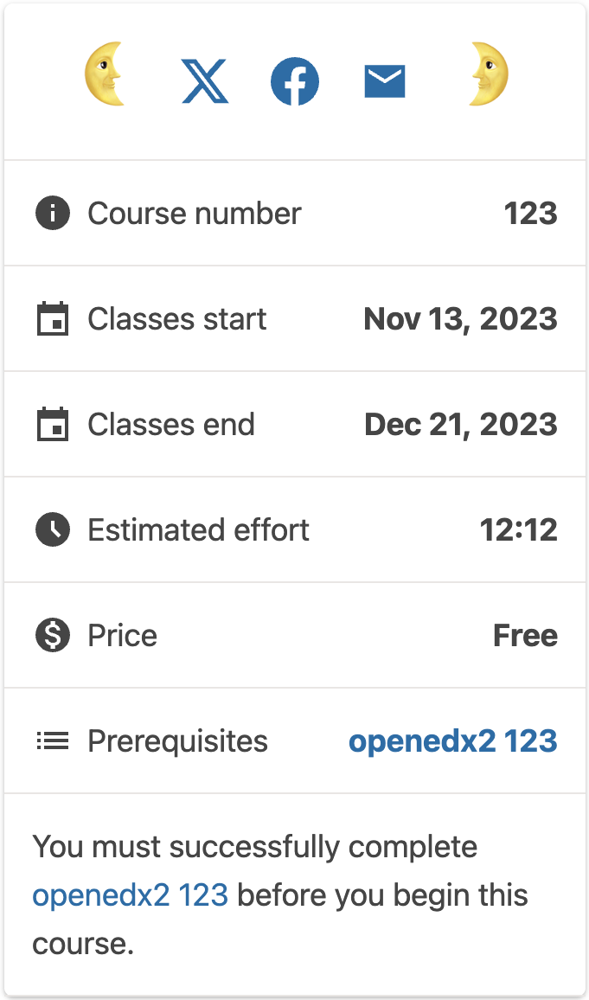

# Course about page sidebar social slot

### Slot ID: `org.openedx.frontend.catalog.course_about_page.sidebar.social`

## Description

This slot is used to replace/modify/hide the entire Course about page sidebar social links.

## Examples

### Modify Items

#### Replace All Items

The following `env.config.jsx` will replace all items in the sidebar social slot.



```tsx
import { PLUGIN_OPERATIONS } from '@openedx/frontend-plugin-framework';
import {
  BsGithub as BsBsGithubIcon,
  BsLinkedin as BsLinkedinIcon,
  BsPlaystation as BsPlaystationIcon,
} from '@openedx/paragon/icons';

const modifySocialLinks = (widget) => {
  widget.content.socialLinks = [
    {
      id: 'linkedin',
      destination: 'https://linkedin.com/share',
      icon: BsLinkedinIcon,
      screenReaderText: 'Share on LinkedIn',
    },
    {
      id: 'playstation',
      destination: 'https://playstation.com',
      icon: BsPlaystationIcon,
      screenReaderText: 'Share on Playstation',
    },
    {
      id: 'github',
      destination: 'https://github.com',
      icon: BsBsGithubIcon,
      screenReaderText: 'Share on GitHub',
    },
  ];
  return widget;
};

const config = {
  pluginSlots: {
    'org.openedx.frontend.catalog.course_about_page.sidebar.social': {
      keepDefault: true,
      plugins: [
        {
          op: PLUGIN_OPERATIONS.Modify,
          widgetId: 'default_contents',
          fn: modifySocialLinks,
        },
      ]
    }
  },
}

export default config;
```

#### Add Items

The following `env.config.jsx` will add items in the sidebar social slot.



```tsx
import { PLUGIN_OPERATIONS } from '@openedx/frontend-plugin-framework';
import {
  BsGithub as BsBsGithubIcon,
  BsLinkedin as BsLinkedinIcon,
  BsPlaystation as BsPlaystationIcon,
} from '@openedx/paragon/icons';

const modifySocialLinks = (widget) => {
  const existingLinks = widget.content.socialLinks || widget.RenderWidget?.props?.socialLinks || [];

  const newSocialLinks = [
    {
      id: 'linkedin',
      destination: 'https://linkedin.com/share',
      icon: BsLinkedinIcon,
      screenReaderText: 'Share on LinkedIn',
    },
    {
      id: 'playstation',
      destination: 'https://playstation.com',
      icon: BsPlaystationIcon,
      screenReaderText: 'Share on Playstation',
    },
    {
      id: 'github',
      destination: 'https://github.com',
      icon: BsBsGithubIcon,
      screenReaderText: 'Share on GitHub',
    },
  ];

  widget.content.socialLinks = [...existingLinks, ...newSocialLinks];
  return widget;
};

const config = {
  pluginSlots: {
    'org.openedx.frontend.catalog.course_about_page.sidebar.social': {
      keepDefault: true,
      plugins: [
        {
          op: PLUGIN_OPERATIONS.Modify,
          widgetId: 'default_contents',
          fn: modifySocialLinks,
        },
      ]
    }
  },
}

export default config;
```

### Replace Menu with Custom Component

The following `env.config.jsx` will replace the the sidebar social slot entirely (in this case with a centered 🗺️ `h1`)



```tsx
import { DIRECT_PLUGIN, PLUGIN_OPERATIONS } from '@openedx/frontend-plugin-framework';

const config = {
  pluginSlots: {
    'org.openedx.frontend.catalog.course_about_page.sidebar.social': {
      keepDefault: false,
      plugins: [
        {
          op: PLUGIN_OPERATIONS.Insert,
          widget: {
            id: 'custom_social_links_component',
            type: DIRECT_PLUGIN,
            RenderWidget: () => (
              <h1 style={{textAlign: 'center'}}>🗺️</h1>
            ),
          },
        },
      ]
    }
  },
}

export default config;
```

### Add Custom Components before and after Menu

The following `env.config.jsx` will place custom components before and after the sidebar social slot (in this case centered `h1`s with 🌜 and 🌛).



```tsx
import { DIRECT_PLUGIN, PLUGIN_OPERATIONS } from '@openedx/frontend-plugin-framework';

const config = {
  pluginSlots: {
    'org.openedx.frontend.catalog.course_about_page.sidebar.social': {
      keepDefault: true,
      plugins: [
        {
          op: PLUGIN_OPERATIONS.Insert,
          widget: {
            id: 'custom_before_social_links_component',
            type: DIRECT_PLUGIN,
            priority: 10,
            RenderWidget: () => (
              <h1 style={{textAlign: 'center'}}>🌜</h1>
            ),
          },
        },
        {
          op: PLUGIN_OPERATIONS.Insert,
          widget: {
            id: 'custom_after_social_links_component',
            type: DIRECT_PLUGIN,
            priority: 90,
            RenderWidget: () => (
              <h1 style={{textAlign: 'center'}}>🌛</h1>
            ),
          },
        },
      ]
    }
  },
}

export default config;
```
