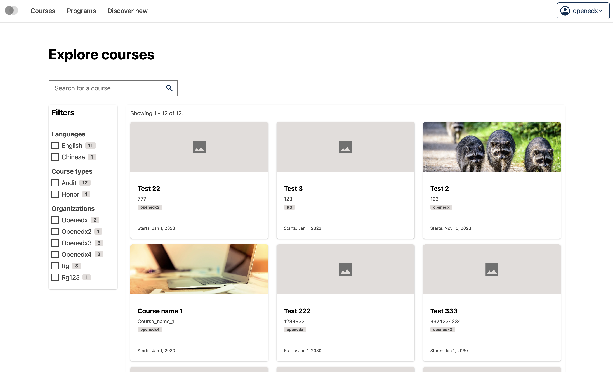
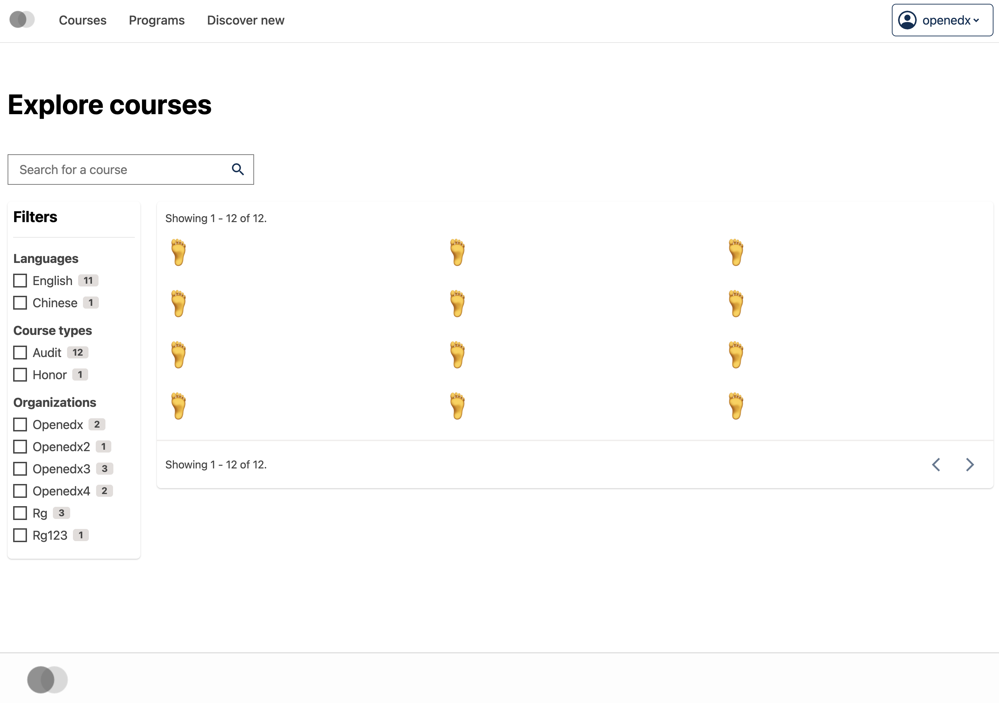
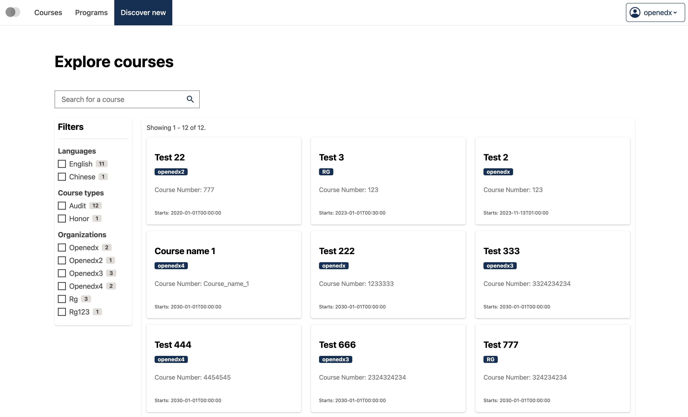

# Course catalog page data table course card slot

### Slot ID: `org.openedx.frontend.catalog.course_catalog_page.data_table.course_card`

## Description

This slot is used to replace/modify/hide the entire Course catalog page data table course card.

### Plugin Props:

* `isLoading` - Boolean. Indicates whether the course card is currently in a loading state.
* `courseId` - String. The unique identifier of the course.
* `courseOrg` - String. The organization that offers the course.
* `courseName` - String. The display name of the course.
* `courseNumber` - String. The course number.
* `courseImageUrl` - String. The URL path to the course image.
* `courseStartDate` - String. The start date of the course in ISO format.
* `courseAdvertisedStart` - String. The advertised start date of the course.

## Examples

### Default content



### Replaced with custom component



The following `env.config.tsx` will replace the Course catalog page data table course card entirely (in this case with a centered `h1` tag)

```tsx
import { DIRECT_PLUGIN, PLUGIN_OPERATIONS } from '@openedx/frontend-plugin-framework';

const config = {
  pluginSlots: {
    'org.openedx.frontend.catalog.course_catalog_page.data_table.course_card': {
      keepDefault: false,
      plugins: [
        {
          op: PLUGIN_OPERATIONS.Insert,
          widget: {
            id: 'custom_course_catalog_page_data_table_course_card_component',
            type: DIRECT_PLUGIN,
            RenderWidget: () => (
              <h1 style={{textAlign: 'center'}}>🦶</h1>
            ),
          },
        },
      ]
    }
  },
}

export default config;
```

### Custom component with plugin props



The following `env.config.tsx` example demonstrates how to replace the Course catalog page data table course card slot with a custom component that uses the plugin props. In this case, it creates a custom card component that displays course information in a different format.

```tsx
import { DIRECT_PLUGIN, PLUGIN_OPERATIONS } from '@openedx/frontend-plugin-framework';
import { Card, Badge } from '@openedx/paragon';
import { Link } from 'react-router-dom';

const config = {
  pluginSlots: {
    'org.openedx.frontend.catalog.course_catalog_page.data_table.course_card': {
      keepDefault: false,
      plugins: [
        {
          op: PLUGIN_OPERATIONS.Insert,
          widget: {
            id: 'custom_course_catalog_page_data_table_course_card_component',
            type: DIRECT_PLUGIN,
            RenderWidget: ({
              isLoading,
              courseId,
              courseOrg,
              courseName,
              courseNumber,
              courseImageUrl,
              courseStartDate,
              courseAdvertisedStart,
            }) => {
              if (isLoading) {
                return <Card isLoading />;
              }

              if (!courseId) {
                return null;
              }

              return (
                <Card
                  as={Link}
                  to={`/courses/${courseId}/about`}
                  isClickable
                >
                  <Card.Header
                    title={courseName}
                    subtitle={
                      <Badge>{courseOrg}</Badge>
                    }
                  />
                  <Card.Section>
                    <p className="text-muted font-size-sm">
                      Course Number: {courseNumber}
                    </p>
                  </Card.Section>
                  <Card.Footer textElement={courseStartDate ? `Starts: ${courseStartDate}` : ''} />
                </Card>
              );
            },
          },
        },
      ]
    }
  },
}

export default config;
```
