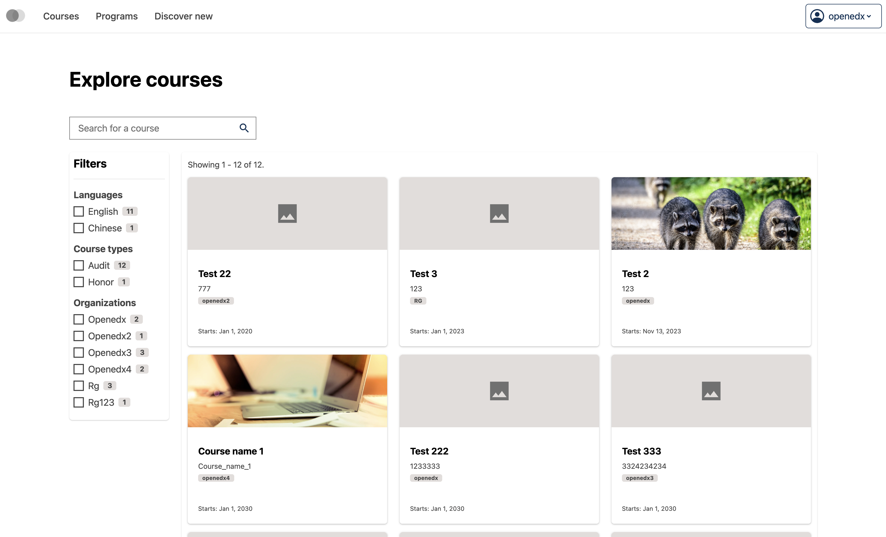
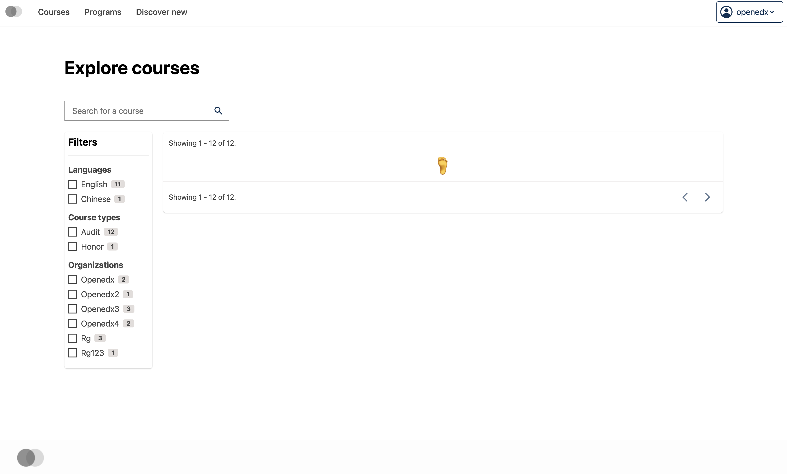
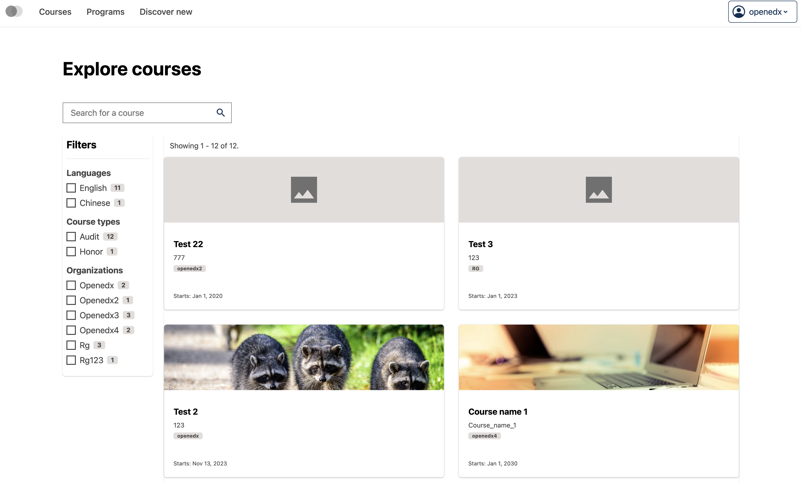

# Course catalog page data table card view slot

### Slot ID: `org.openedx.frontend.catalog.course_catalog_page.data_table.card_view`

## Description

This slot is used to replace/modify/hide the entire Course catalog page data table card view section.

## Examples

### Default content



### Replaced with custom component



The following `env.config.tsx` will replace the Course catalog page data table card view section entirely (in this case with a centered `h1` tag)

```tsx
import { DIRECT_PLUGIN, PLUGIN_OPERATIONS } from '@openedx/frontend-plugin-framework';

const config = {
  pluginSlots: {
    'org.openedx.frontend.catalog.course_catalog_page.data_table.card_view': {
      keepDefault: false,
      plugins: [
        {
          op: PLUGIN_OPERATIONS.Insert,
          widget: {
            id: 'custom_course_catalog_page_data_table_footer_component',
            type: DIRECT_PLUGIN,
            RenderWidget: () => (
              <h1 style={{textAlign: 'center'}}>🦶</h1>
            ),
          },
        },
      ]
    }
  },
}

export default config;
```

### Custom component with plugin props



The following `env.config.tsx` example demonstrates how to replace the Course catalog page data table card view slot with a custom component that uses the plugin props (`displayData`). In this case, it creates a custom grid layout (2 columns) while using the standard course card component through the plugin slot system.

```tsx
import { DIRECT_PLUGIN, PLUGIN_OPERATIONS } from '@openedx/frontend-plugin-framework';
import CourseCatalogDataTableCourseCardSlot from '@src/plugin-slots/CourseCatalogDataTableSlots/CourseCatalogDataTableCardViewSlot/CourseCatalogDataTableCourseCardSlot';

const config = {
  pluginSlots: {
    'org.openedx.frontend.catalog.course_catalog_page.data_table.card_view': {
      keepDefault: false,
      plugins: [
        {
          op: PLUGIN_OPERATIONS.Insert,
          widget: {
            id: 'custom_course_catalog_page_data_table_card_view_component',
            type: DIRECT_PLUGIN,
            RenderWidget: ({ displayData }) => {
              if (!displayData || !displayData.results) {
                return null;
              }

              return (
                <div
                  style={{
                    display: 'grid',
                    gridTemplateColumns: 'repeat(2, 1fr)',
                    gap: '2rem',
                  }}
                >
                  {displayData.results.map((course) => (
                    <CourseCatalogDataTableCourseCardSlot
                      key={course.id}
                      original={course}
                      isLoading={false}
                    />
                  ))}
                </div>
              );
            },
          },
        },
      ]
    }
  },
}

export default config;
```
