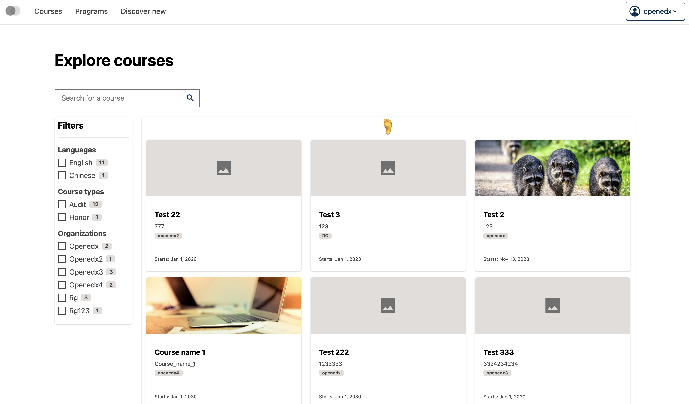
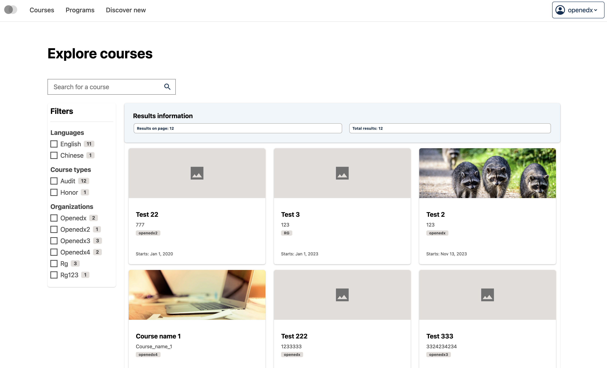

# Course catalog page data table control bar slot

### Slot ID: `org.openedx.frontend.catalog.course_catalog_page.data_table.control_bar`

## Description

This slot is used to replace/modify/hide the entire Course catalog page data table control bar.

### Plugin Props:

* `currentPageResultsCount` - Number. The current number of results displayed on the current page.
* `totalResultsCount` - Number. The total number of search results available.

## Examples

### Default content


### Replaced with custom component



The following `env.config.tsx` will replace the Course catalog page data table control bar entirely (in this case with a centered `h1` tag)

```tsx
import { DIRECT_PLUGIN, PLUGIN_OPERATIONS } from '@openedx/frontend-plugin-framework';

const config = {
  pluginSlots: {
    'org.openedx.frontend.catalog.course_catalog_page.data_table.control_bar': {
      keepDefault: false,
      plugins: [
        {
          op: PLUGIN_OPERATIONS.Insert,
          widget: {
            id: 'custom_course_catalog_page_data_table_control_bar_component',
            type: DIRECT_PLUGIN,
            RenderWidget: () => (
              <h1 style={{textAlign: 'center'}}>🦶</h1>
            ),
          },
        },
      ]
    }
  },
}

export default config;
```

### Custom component with plugin props



The following `env.config.tsx` example demonstrates how to replace the Course catalog page data table control bar slot with a custom component that uses the plugin props (`currentPageResultsCount` and `totalResultsCount`). In this case, it creates an alert component with results count information.

```tsx
import { DIRECT_PLUGIN, PLUGIN_OPERATIONS } from '@openedx/frontend-plugin-framework';
import { Alert, Stack, Chip } from '@openedx/paragon';

const config = {
  pluginSlots: {
    'org.openedx.frontend.catalog.course_catalog_page.data_table.control_bar': {
      keepDefault: false,
      plugins: [
        {
          op: PLUGIN_OPERATIONS.Insert,
          widget: {
            id: 'custom_course_catalog_page_data_table_control_bar_component',
            type: DIRECT_PLUGIN,
            RenderWidget: ({ currentPageResultsCount, totalResultsCount }) => {
              return (
                <Alert variant="info">
                  <Alert.Heading>Results information</Alert.Heading>
                  <Stack direction="horizontal" gap={3}>
                    <Chip>
                      Results on page: {currentPageResultsCount}
                    </Chip>
                    <Chip>
                      Total results: {totalResultsCount}
                    </Chip>
                  </Stack>
                </Alert>
              );
            },
          },
        },
      ]
    }
  },
}

export default config;
```