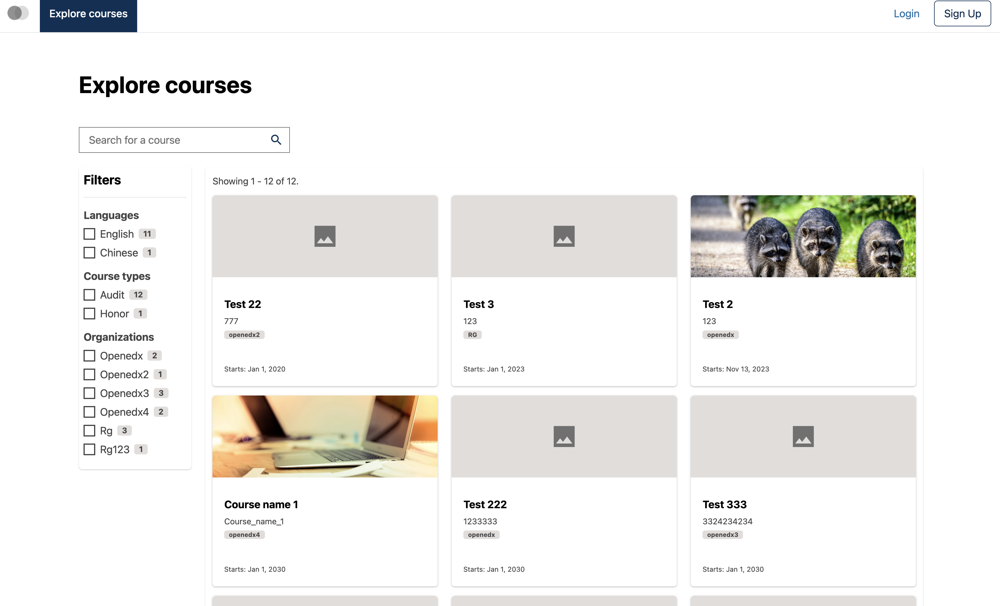
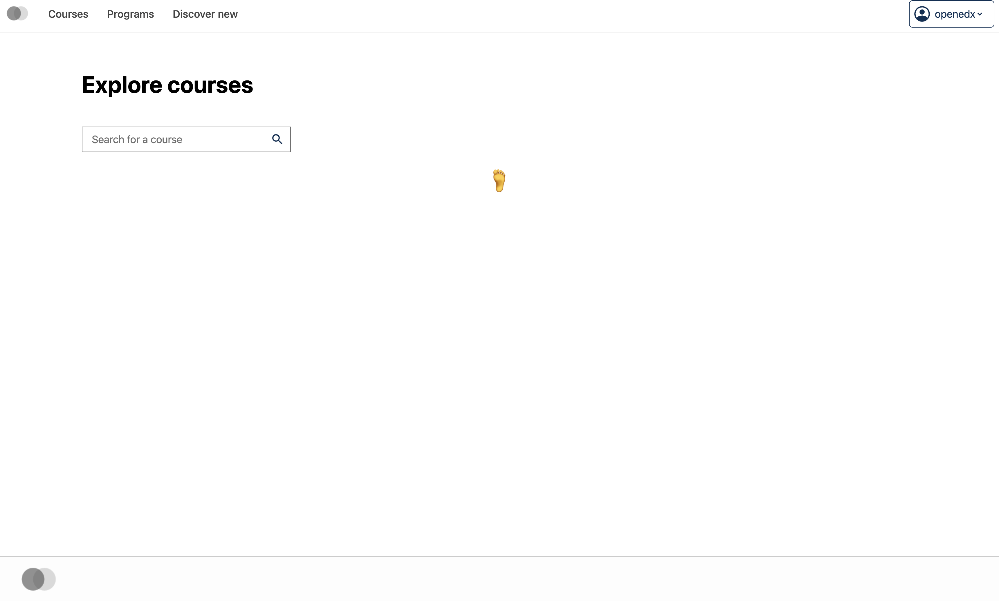
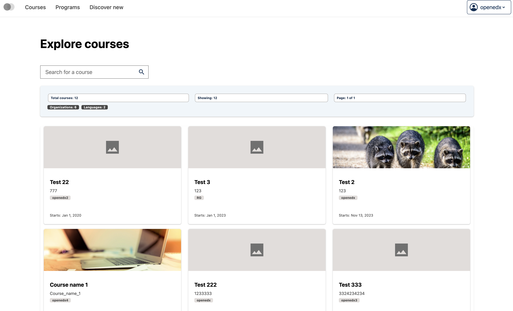

# Course catalog page data table slot

### Slot ID: `org.openedx.frontend.catalog.course_catalog_page.data_table`

## Description

This slot is used to replace/modify/hide the entire Course catalog page data table.

### Plugin Props:

* `displayData` - Object. The course list search response data containing search results, total count, aggregations, and other metadata.
* `totalCourses` - Number. The total number of courses available in the catalog.
* `pageCount` - Number. The total number of pages available for pagination, calculated based on total courses and page size.
* `pageIndex` - Number. The zero-based index of the currently active page in the data table pagination.
* `tableColumns` - Array. The column definitions for the data table, including headers, accessors, filters, and filter choices. Generated from course aggregations.
* `handleFetchData` - Function. Handles fetching data for the data table when pagination, sorting, or filtering changes.

## Examples

### Default content



### Replaced with custom component



The following `env.config.tsx` will replace the Course catalog page data table entirely (in this case with a centered `h1` tag)

```tsx
import { DIRECT_PLUGIN, PLUGIN_OPERATIONS } from '@openedx/frontend-plugin-framework';

const config = {
  pluginSlots: {
    'org.openedx.frontend.catalog.course_catalog_page.data_table': {
      keepDefault: false,
      plugins: [
        {
          op: PLUGIN_OPERATIONS.Insert,
          widget: {
            id: 'custom_course_catalog_page_data_table_course_card_component',
            type: DIRECT_PLUGIN,
            RenderWidget: () => (
              <h1 style={{textAlign: 'center'}}>🦶</h1>
            ),
          },
        },
      ]
    }
  },
}

export default config;
```

### Custom component with plugin props



The following `env.config.tsx` example demonstrates how to replace the Course catalog page data table slot with a custom component that uses the plugin props. In this case, it creates a custom data table with statistics panel showing total courses, current page information, and aggregation counts (organizations and languages).

```tsx
import { useState } from 'react';
import { DIRECT_PLUGIN, PLUGIN_OPERATIONS } from '@openedx/frontend-plugin-framework';
import { DataTable, TextFilter, CardView, Alert, Stack, Chip, SearchField, Badge } from '@openedx/paragon';
import { DEFAULT_PAGE_SIZE } from '@src/data/course-list-search/constants';
import { CourseCatalogDataTableCourseCardSlot } from '@src/plugin-slots/CourseCatalogDataTableSlots';

const config = {
  pluginSlots: {
    'org.openedx.frontend.catalog.course_catalog_page.data_table': {
      keepDefault: false,
      plugins: [
        {
          op: PLUGIN_OPERATIONS.Insert,
          widget: {
            id: 'custom_course_catalog_page_data_table_component',
            type: DIRECT_PLUGIN,
            RenderWidget: ({
              displayData,
              totalCourses,
              pageCount,
              pageIndex,
              tableColumns,
              handleFetchData,
            }) => {
              const [searchValue, setSearchValue] = useState('');
              const coursesCount = displayData?.results?.length ?? 0;
              const total = displayData?.total ?? totalCourses;
              const currentPage = pageIndex + 1;
              const aggs = displayData?.aggs;

              const orgCount = aggs?.org?.terms ? Object.keys(aggs.org.terms).length : 0;
              const languageCount = aggs?.language?.terms ? Object.keys(aggs.language.terms).length : 0;

              return (
                <Stack gap={3}>
                  <Alert variant="info">
                    <Stack gap={2}>
                      <Stack direction="horizontal" gap={3}>
                        <Chip>Total courses: {total}</Chip>
                        <Chip>Showing: {coursesCount}</Chip>
                        <Chip>Page: {currentPage} of {pageCount}</Chip>
                      </Stack>
                      {(orgCount > 0 || languageCount > 0) && (
                        <Stack direction="horizontal" gap={2}>
                          {orgCount > 0 && <Badge variant="secondary">Organizations: {orgCount}</Badge>}
                          {languageCount > 0 && <Badge variant="secondary">Languages: {languageCount}</Badge>}
                        </Stack>
                      )}
                    </Stack>
                  </Alert>

                  <DataTable
                    isFilterable
                    isSortable
                    isPaginated
                    manualFilters
                    manualPagination
                    defaultColumnValues={{ Filter: TextFilter }}
                    itemCount={total}
                    pageSize={DEFAULT_PAGE_SIZE}
                    pageCount={pageCount}
                    initialState={{ pageSize: DEFAULT_PAGE_SIZE, pageIndex }}
                    data={displayData?.results}
                    columns={tableColumns}
                    fetchData={handleFetchData}
                    initialTableOptions={{ getRowId: (row) => row.id }}
                  >
                    <CardView
                      CardComponent={CourseCatalogDataTableCourseCardSlot}
                      skeletonCardCount={Math.min(displayData?.total ?? DEFAULT_PAGE_SIZE, DEFAULT_PAGE_SIZE)}
                    />
                  </DataTable>
                </Stack>
              );
            },
          },
        },
      ]
    }
  },
}

export default config;
```
