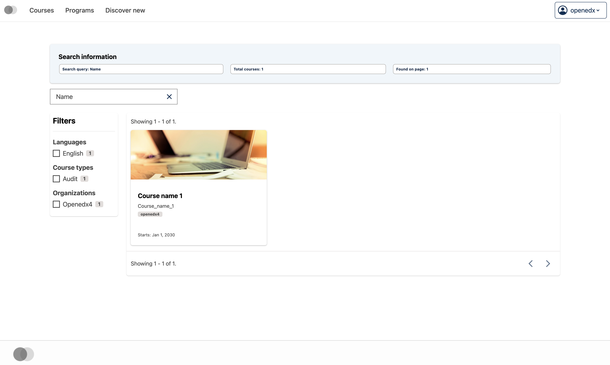

# Course catalog page intro slot

### Slot ID: `org.openedx.frontend.catalog.course_catalog_page.intro`

## Description

This slot is used to replace/modify/hide the entire Course catalog page intro section.

### Plugin Props:

* `searchString` - String. The current search query string entered by the user in the course catalog search field.
* `courseData` - Object. The course list search response data containing search results, total count, aggregations, and other metadata.

## Examples

### Default content


### Replaced with custom component


The following `env.config.tsx` will replace the Course catalog page intro section entirely (in this case with a centered `h1` tag)

```tsx
import { DIRECT_PLUGIN, PLUGIN_OPERATIONS } from '@openedx/frontend-plugin-framework';

const config = {
  pluginSlots: {
    'org.openedx.frontend.catalog.course_catalog_page.intro': {
      keepDefault: false,
      plugins: [
        {
          op: PLUGIN_OPERATIONS.Insert,
          widget: {
            id: 'custom_course_catalog_page_intro_component',
            type: DIRECT_PLUGIN,
            RenderWidget: () => (
              <h1 style={{textAlign: 'center'}}>🦶</h1>
            ),
          },
        },
      ]
    }
  },
}

export default config;
```

### Custom component with plugin props



The following `env.config.tsx` example demonstrates how to replace the Course catalog page intro slot with a custom component that uses the plugin props (`searchString` and `courseData`). In this case, it creates an alert component with page information.

```tsx
import { DIRECT_PLUGIN, PLUGIN_OPERATIONS } from '@openedx/frontend-plugin-framework';
import { Alert, Stack, Chip } from '@openedx/paragon';

const config = {
  pluginSlots: {
    'org.openedx.frontend.catalog.course_catalog_page.intro': {
      keepDefault: false,
      plugins: [
        {
          op: PLUGIN_OPERATIONS.Insert,
          widget: {
            id: 'custom_course_catalog_page_intro_component',
            type: DIRECT_PLUGIN,
            RenderWidget: ({ searchString, courseData }) => {
              const totalCourses = courseData?.total ?? 0;
              const resultsCount = courseData?.results?.length ?? 0;

              return (
                <Alert variant="info">
                  <Alert.Heading>Search information</Alert.Heading>
                  <Stack direction="horizontal" gap={3}>
                    <Chip>
                      Search query: {searchString || '(none)'}
                    </Chip>
                    <Chip>
                      Total courses: {totalCourses}
                    </Chip>
                    <Chip>
                      Found on page: {resultsCount}
                    </Chip>
                  </Stack>
                </Alert>
              );
            },
          },
        },
      ]
    }
  },
}

export default config;
```
