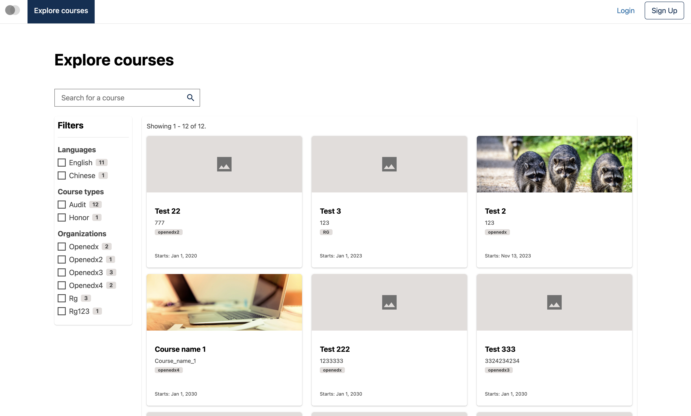
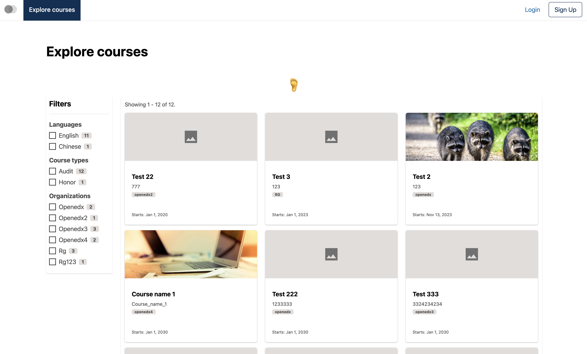
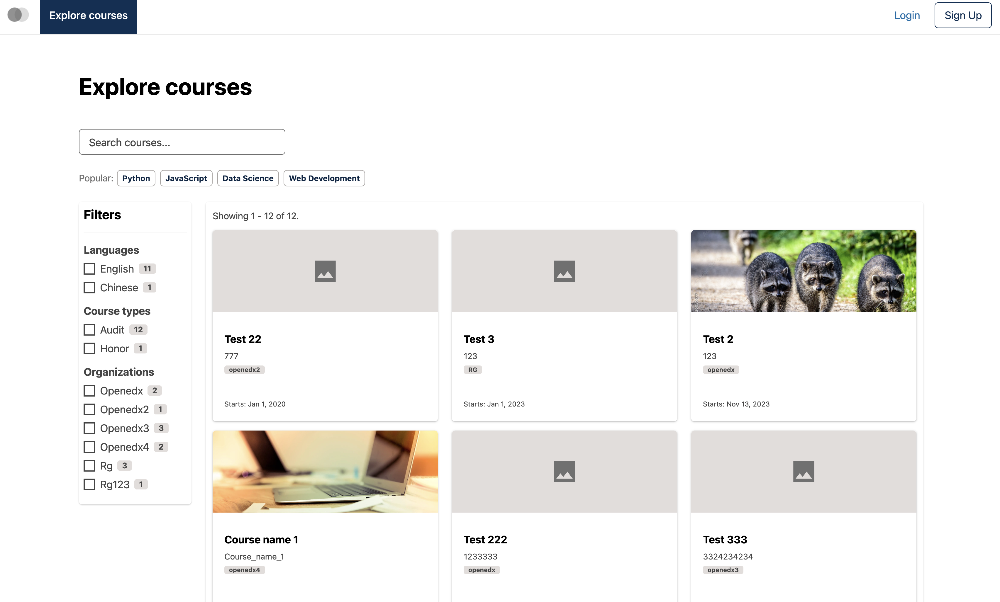

# Course catalog page search field slot

### Slot ID: `org.openedx.frontend.catalog.course_catalog_page.search_field`

## Description

This slot is used to replace/modify/hide the entire Course catalog page search field.

### Plugin Props:

* `setSearchInput` - Function. Sets the search input value in the component state.
* `handleSearch` - Function. Handles the search submission and triggers the search operation.

## Examples

### Default content



### Replaced with custom component



The following `env.config.tsx` will replace the Course catalog page search field entirely (in this case with a centered `h1` tag)

```tsx
import { DIRECT_PLUGIN, PLUGIN_OPERATIONS } from '@openedx/frontend-plugin-framework';

const config = {
  pluginSlots: {
    'org.openedx.frontend.catalog.course_catalog_page.search_field': {
      keepDefault: false,
      plugins: [
        {
          op: PLUGIN_OPERATIONS.Insert,
          widget: {
            id: 'custom_course_catalog_page_search_field_component',
            type: DIRECT_PLUGIN,
            RenderWidget: () => (
              <h1 style={{textAlign: 'center'}}>🦶</h1>
            ),
          },
        },
      ]
    }
  },
}

export default config;
```

### Custom component with plugin props



The following `env.config.tsx` example demonstrates how to replace the Course catalog page search field slot with a custom component that uses the plugin props (`setSearchInput` and `handleSearch`). In this case, it creates a search field with floating label and quick access to popular search queries via clickable chips.

```tsx
import { useState } from 'react';
import { DIRECT_PLUGIN, PLUGIN_OPERATIONS } from '@openedx/frontend-plugin-framework';
import { Stack, Chip, Form } from '@openedx/paragon';

const config = {
  pluginSlots: {
    'org.openedx.frontend.catalog.course_catalog_page.search_field': {
      keepDefault: false,
      plugins: [
        {
          op: PLUGIN_OPERATIONS.Insert,
          widget: {
            id: 'custom_course_catalog_page_search_field_component',
            type: DIRECT_PLUGIN,
            RenderWidget: ({ setSearchInput, handleSearch }) => {
              const [searchValue, setSearchValue] = useState('');
              const popularSearches = ['Python', 'JavaScript', 'Data Science', 'Web Development'];

              const handleQuickSearch = (query: string) => {
                setSearchValue(query);
                setSearchInput(query);
                handleSearch(query);
              };

              return (
                <Stack gap={2} className="mb-4 w-25">
                  <Form.Group>
                    <Form.Control
                      floatingLabel="Search courses..."
                      value={searchValue}
                      onChange={(e) => {
                        const value = e.target.value;
                        setSearchValue(value);
                        setSearchInput(value);
                      }}
                    />
                  </Form.Group>
                  <Stack direction="horizontal" gap={1}>
                    <span className="text-muted small">Popular:</span>
                    {popularSearches.map((query) => (
                      <Chip
                        key={query}
                        onClick={() => handleQuickSearch(query)}
                      >
                        {query}
                      </Chip>
                    ))}
                  </Stack>
                </Stack>
              );
            },
          },
        },
      ]
    }
  },
}

export default config;
```
