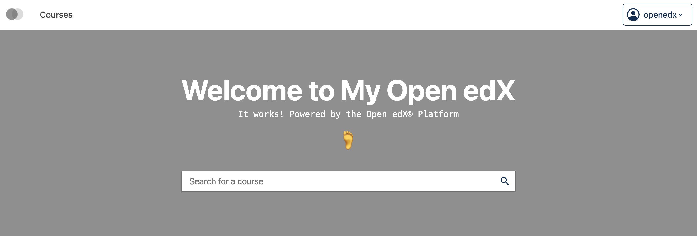

# Home page promo video button slot

### Slot ID: `org.openedx.frontend.catalog.home_page.promo_video_button`

## Description

This slot is used to replace/modify/hide the entire Home page promo video button.

## Examples

### Default content


### Replaced with custom component



The following `env.config.tsx` will replace the Home page promo video button entirely (in this case with a centered `h1` tag)

```tsx
import { DIRECT_PLUGIN, PLUGIN_OPERATIONS } from '@openedx/frontend-plugin-framework';

const config = {
  pluginSlots: {
    'org.openedx.frontend.catalog.home_page.promo_video_button': {
      keepDefault: false,
      plugins: [
        {
          op: PLUGIN_OPERATIONS.Insert,
          widget: {
            id: 'custom_home_page_promo_video_component',
            type: DIRECT_PLUGIN,
            RenderWidget: () => (
              <h1 style={{textAlign: 'center'}}>🦶</h1>
            ),
          },
        },
      ]
    }
  },
}

export default config;
```
