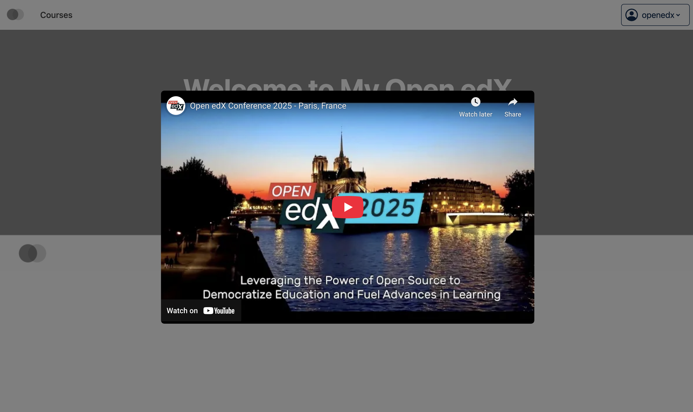
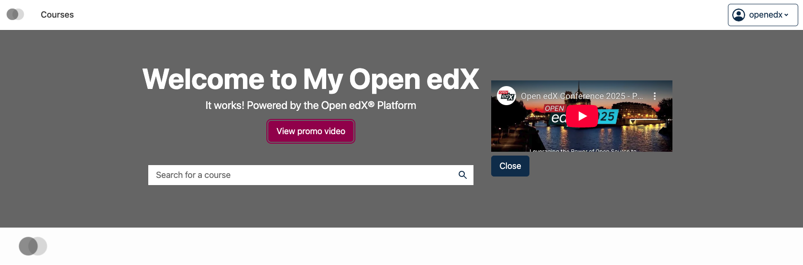

# Home page promo video modal slot

### Slot ID: `org.openedx.frontend.catalog.home_page.promo_video_modal`

## Description

This slot is used to replace/modify/hide the entire Home page promo video modal.

## Examples

### Default content



### Replaced with custom component



The following `env.config.tsx` will replace the Home page promo video modal entirely (in this case with a simple custom modal)

```tsx
import { DIRECT_PLUGIN, PLUGIN_OPERATIONS } from '@openedx/frontend-plugin-framework';
import { Button } from '@openedx/paragon';

const config = {
  pluginSlots: {
    'org.openedx.frontend.catalog.home_page.promo_video_modal': {
      keepDefault: false,
      plugins: [
        {
          op: PLUGIN_OPERATIONS.Insert,
          widget: {
            id: 'custom_home_page_promo_video_modal_component',
            type: DIRECT_PLUGIN,
            RenderWidget: ({ isOpen, videoId, close }) => {
              if (!isOpen) return null;

              return (
                <div className="custom-video-modal-wrapper">
                  <iframe
                    src={`https://www.youtube.com/embed/${videoId}`}
                    width="100%"
                    height="100%"
                    frameBorder="0"
                    allowFullScreen
                  />
                  <Button onClick={close}>Close</Button>
                </div>
              );
            },
          },
        },
      ]
    }
  },
}

export default config;
```
