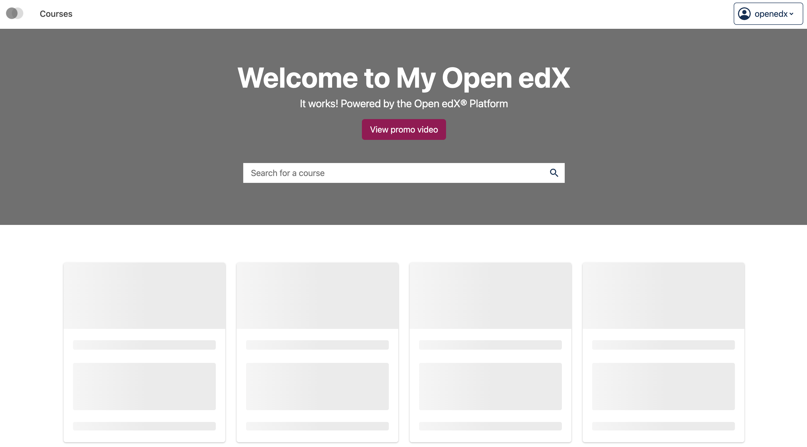
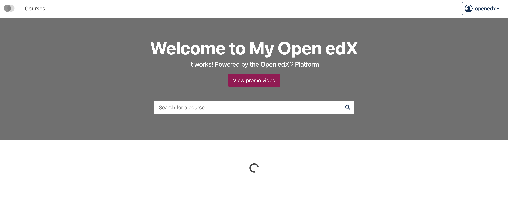

# Generic loader slot

### Slot ID: `org.openedx.frontend.catalog.generic.loader`

## Description

This slot is used to replace/modify/hide the entire content of a specified container during a loading state.

## Examples

### Default content



### Replaced with custom component



The following `env.config.tsx` will replace the default course cards skeleton on the Home page with a centered spinner component:

```tsx
import { DIRECT_PLUGIN, PLUGIN_OPERATIONS } from '@openedx/frontend-plugin-framework';
import { Spinner, Container } from '@openedx/paragon';

const config = {
  pluginSlots: {
    'org.openedx.frontend.catalog.generic.loader': {
      keepDefault: false,
      plugins: [
        {
          op: PLUGIN_OPERATIONS.Insert,
          widget: {
            id: 'custom_generic_loader_component',
            type: DIRECT_PLUGIN,
            RenderWidget: () => (
              <Container className="text-center">
                <Spinner animation="border" screenReaderText="Loading..." />
              </Container>
            ),
          },
        },
      ]
    }
  },
}

export default config;
```
